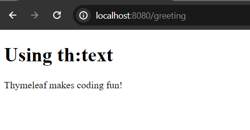
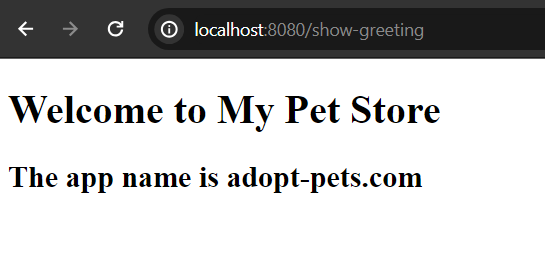
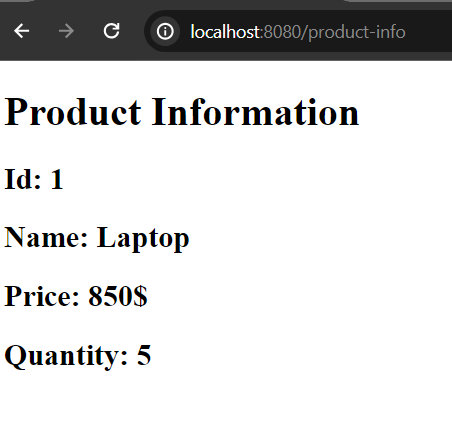
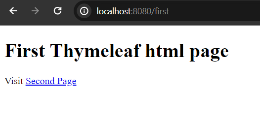
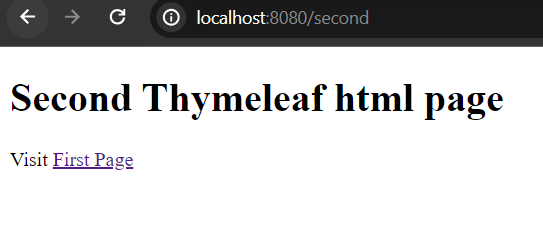
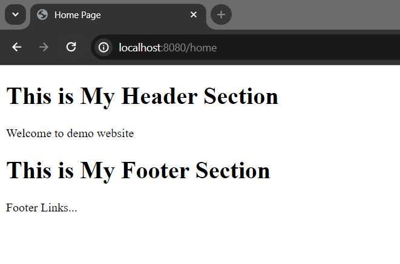

# Thymeleaf Standard Dialects

In this simple tutorial, we are going to talk about thymeleaf standard dialects expression syntax. Those we can use in our application to show data from the java component.

All the thymeleaf expression syntax starts with th: prefix. Like ```<span th:text="" />```

# Thymeleaf Standard Dia \ lects expression syntax: 

```
${...}: Variable expression
*{...}: Selection expression
#{...}: Message expressions (able to read from custom messages from messages.porperties (default is en), messages_en.properties, messages_fr.properties, messages_de.properties files)
@{...}: Link expression (works like <a href="#"/> out of the box)
~{...}: Fragment expression (helpful for reusing the same code within your application)
```

# Let's check out all the thymeleaf standard dialects

Let's see how to use thymeleaf variable expression, selection expression etc. in our spring boot application. Assume that, You have already a spring boot powered application in your system. If you don't have one yet, recommend to create one from spring initilizer, https://start.spring.io or please check this tutorial: How to create your first Spirng Boot appliction.

# Thyemeleaf Variable expression.

Open your spring boot project and create a simple GreetingController.java file in your com.company.controller package. The GreetingController will look like the following.

```
package com.company.controller;

import org.springframework.stereotype.Controller;
import org.springframework.ui.Model;
import org.springframework.web.bind.annotation.GetMapping;

@Controller
public class GreetingController {
    @GetMapping("/greeting")
    public String showGreeting(Model model){

        String text = "Thymeleaf makes coding fun!";
        model.addAttribute("message", text); //the first attribute will be used in the template
        return "greeting"; //template file name: greeting.html
    }
}

```

Note: We use Model to access the java code or expression from our template. 

Then now create a template html file inside the templates folder. 

The file name can be anything but should be match the controller return string value.

```js
<!DOCTYPE html>
<html lang="en" xmlns:th="http://www.w3.org/1999/xhtml">
<head>
    <meta charset="UTF-8">
    <meta name="viewport" content="width=device-width, initial-scale=1.0">
    <title>Document</title>
</head>
<body>
<h1>Using th:text</h1>
<p th:text="${message}"></p>
</body>
</html>
```

So, run your spring boot application and if you now invoke this url: [http://localhost:8080/greeting](http://localhost:8080/greeting) You will get the following html page.



Now, it make sense how we can access the variable expression in thymeleaf. In fact, we can everywhere use thymeleaf variable expression in order to show java component data or variable. 

## Thymeleaf Message expression.

The message expression is used for showing different quick format welcome messages in your application. The messages.properties file should be reside on resources directory and it names must be messages.properties file.

The message expression syntax: #{property_name.optional_parameter}

Here the property name is the key and the value of this key will be displayed. Yes, there may be optional additonal parameters too.

In thymeleaf template (html file) we will write the following:

```js
<p th:text="#{property_name}"></p>
<p th:text="#{property_name.parameter_name}></p>

//such as if we want to access the message property's value then we should write:
<p th:text="#{message}"></p> 
//with optional parameter
<p th:text="#{welcome.message}"></p>
```

Now, let's create messages.properties file in the resources folder.

Note: The externalize messages file name must be messages.properties.

```js
welcome.message=Welcome to My Pet Store
welcome.app.name=The app name is adopt-pets.com
```

And then in your greeting.html template file, write the following message expression so that welcome.message value will be retrieved.

```js
<h1 th:text="#{welcome.app.name}">
<h1 th:text="#{welcome.message}"></h1>
```

If you now run the application you get the messages that you mention inside messages.properties file.




## Thymeleaf Selection expression

Thymeleaf selection expression just works like variable expression but it is used to retrieve data from object than the complete variable. 

The selection expression syntax: 

```
<div th:object="${object_name}>

<p th:text="*{obj_property}"></p>
<p th:text=*{obj_property}></p>
...
</div>

//Like

<div th:object="${product}>
<p th:text="*{name}"></p>
<p th:text=*{price}></p>
...
</div>
```

Here is a simple selection expression example:

1. Create a domain model or java class called Product.java in your srping boot application.

```
package com.company.entity;

public class Product {
    private int id;
    private String name;
    private int price;
    private int quantity;

    public Product() {
    }

    public Product(int id, String name, int price, int quantity) {
        this.id = id;
        this.name = name;
        this.price = price;
        this.quantity = quantity;
    }

    public int getId() {
        return id;
    }

    public void setId(int id) {
        this.id = id;
    }

    public String getName() {
        return name;
    }

    public void setName(String name) {
        this.name = name;
    }

    public int getPrice() {
        return price;
    }

    public void setPrice(int price) {
        this.price = price;
    }

    public int getQuantity() {
        return quantity;
    }

    public void setQuantity(int quantity) {
        this.quantity = quantity;
    }
}
```

2. Now create a controller class called ProductController and annotate it by @Controller annotaion so that we can show product data in the templates (html files) folder.

```
package com.company.controller;

import com.company.entity.Product;
import org.springframework.ui.Model;
import org.springframework.web.bind.annotation.GetMapping;

@Controller
public class ProductController {
    
    @GetMapping("/product-info")
    public String showProduct(Model model){
        //create a product
        Product p = new Product(1, "Laptop", 850, 5);
        model.addAttribute("product", p);
        return "product";
    }
    
}
```

3. Create product.html template file in the templates directorty.

```
<!DOCTYPE html>
<html lang="en" xmlns:th="http://www.w3.org/1999/xhtml">
<html lang="en" xmlns:th="http://www.thymeleaf.org">
<head>
    <meta charset="UTF-8">
    <meta name="viewport" content="width=device-width, initial-scale=1.0">
    <title>Thymeleaf tutorial</title>
</head>
<body>
<div>
    <h1>Product Information</h1>
    <div th:object="${product}">
        <h2>Id: <span th:text="*{id}"></span></h2>
        <h2>Name: <span th:text="*{name}"></span></h2>
        <h2>Price: <span th:text="*{price}"></span>$ </h2>
        <h2>Quantity: <span th:text="*{quantity}"></span></h2>
    </div>
</div>
</body>
</html>
```

4. Run the example srping boot applicaton now and if you visit the url: [http://localhost:8080/product-info](http://localhost:8080/product-info) in your favourite web browser you will see the product information. 




## Thymeleaf URL expression.

Like a regular html link expression ```<a href="#">Link</a>```, Thymeleaf also have built in url or link expression (with additional support). 

URL expression syntax:

```
<a th:href="@{/#}>Link</a>
```

Like you have a greeting uri. You can use ```<a th:href="@{/greeting}">Greeting</a>``` and can access the template page. It works like html link tag (a tag) out of the box.

**Let's check out a simple example**

Now create two html template file in your templates folder (Assume that you have Spring boot applicaton and thymeleaf dependency in your classpath).

**first.html** file: (located in: src/main/resources/templates folder)

```
<!DOCTYPE html>
<html lang="en" xmlns:th="http://www.w3.org/1999/xhtml">
<html lang="en" xmlns:th="http://www.thymeleaf.org">
<head>
  <meta charset="UTF-8">
  <meta name="viewport" content="width=device-width, initial-scale=1.0">
  <title>First Html Page</title>
</head>
<body>

<div>
 <h1>First Thymeleaf html page</h1>
  <p>Visit <a th:href="@{/second}">Second Page</a></p>
</div>
</body>
</html>
```

**Second.html** file (located in: src/main/resources/templates folder)

```
<!DOCTYPE html>
<html lang="en" xmlns:th="http://www.w3.org/1999/xhtml">
<html lang="en" xmlns:th="http://www.thymeleaf.org">
<head>
  <meta charset="UTF-8">
  <meta name="viewport" content="width=device-width, initial-scale=1.0">
  <title>Second Html Page</title>
</head>
<body>

<div>
  <h1>Second Thymeleaf html page</h1>
  <p>Visit <a th:href="@{/first}">First Page</a></p>
</div>
</body>
</html>
```

Now you have to resolve the uri from the controller file. So, please create a controller class like DemoController.java in com.company package. (I use to create additonal packages for controller, repository, service classes in my application).

**DemoController.java**

```
package com.company.controller;

import org.springframework.stereotype.Controller;
import org.springframework.web.bind.annotation.GetMapping;


@Controller
public class DemoController {
    @GetMapping("/first")
    public String showFirstPage(){
        return "first"; //html file name
    }
    @GetMapping("/second")
    public String showSecondPage(){
        return "second"; //html file name
    }
}

```

Now run the application and, if you visit the url: [http://localhost:8080/first](http://localhost:8080/first) you will see the following page.

 

Now click the link of second page and second page will be shown.




# Thymeleaf Fragmetn expression

For making a good layout of your appliction, the fragment expression helps you a lot. Like, you can use the fragmetn expression to reuse the same code or section of your template files. 

Such as, you have **header** and **footer** section or html files, and you can use the same header and footer all of your template files without writng them again. In javascript, we basically use different approaches (include.js) to reuse the same code in multiple files.

**Fragment expression syntax:**

```
//create fragment or reusable section
<div th:fragment="name-of-the-fragment">
<h1>The resuable content</h1>
</div>

//Access the reusable content in different fiels or the same file
<div>
<h1>The fragment (reusable content) content will go below</h1>
<div th:replace="~{file_name :: name-of-the-fragment}">
</div>

//such as you create a header.html and you want to reuse it in home.html file 

//header.html file:

<div th:fragment="header-content">
</h1>Header content</h1>
</div>

//home.html file

<div>
<h1> Heder content will be displayed below</h1>
<div th:replace="~{header :: header-content}">The header content</div>
</div>
```

Note: We use the th:fragment to create a reusable content and th:replace to use the reusable or fragment contents in a new file.


**Let's check out a simple example**

In your template folder (located: src/main/resources/templates) create three html files. The html files are: header.html, footer.html and home.html
 
header.html file:

```
<!DOCTYPE html>
<html lang="en" xmlns:th="http://www.w3.org/1999/xhtml">
<html lang="en" xmlns:th="http://www.thymeleaf.org">
<head>
  <meta charset="UTF-8">
  <meta name="viewport" content="width=device-width, initial-scale=1.0">
  <title>Header Html File</title>
</head>
<body>

<div th:fragment="header-content">
  <h1>This is My Header Section</h1>
  <p>Welcome to demo website</p>
</div>

</body>
</html>
```

**Footer.html** file:

```
<!DOCTYPE html>
<html lang="en" xmlns:th="http://www.w3.org/1999/xhtml">
<html lang="en" xmlns:th="http://www.thymeleaf.org">
<head>
  <meta charset="UTF-8">
  <meta name="viewport" content="width=device-width, initial-scale=1.0">
  <title>Footer Html File</title>
</head>
<body>

<div th:fragment="footer-content">
  <h1>This is My Footer Section</h1>
  <p>Footer Links...</p>
</div>

</body>
</html>
```

**home.html** file: (the file will display the resusable contents)

```
<!DOCTYPE html>
<html lang="en" xmlns:th="http://www.w3.org/1999/xhtml">
<html lang="en" xmlns:th="http://www.thymeleaf.org">
<head>
    <meta charset="UTF-8">
    <meta name="viewport" content="width=device-width, initial-scale=1.0">
    <title>Home Page</title>
</head>
<body>

<!-- Reusing the header content -->
<header>
    <div th:replace="~{header :: header-content}"></div>
</header>

<!-- Reusing the footer content -->
<footer>
    <div th:replace="~{footer :: footer-content}"></div>
</footer>
</body>
</html>
```

Now, please resolve the template files by creating a controller class. Guess, the controller java file name is HomeControlle.java 

**HomeController.java** controller class file:

```
package com.company.controller;

import org.springframework.stereotype.Controller;
import org.springframework.ui.Model;
import org.springframework.web.bind.annotation.GetMapping;

@Controller
public class HomeController {
    @GetMapping("/home")
    public String showHome(Model model){
        return "home"; //home.html file
    }
}
```

Now, the final step: Run your application and invoke the url in your favourite web browser: [http://localhost:8080/home](http://localhost:8080/home) and you will see the following page if everything is going well.




Hope, this simple thymeleaf tutorial, will help a lot to explore the standard dialects with live examples.


