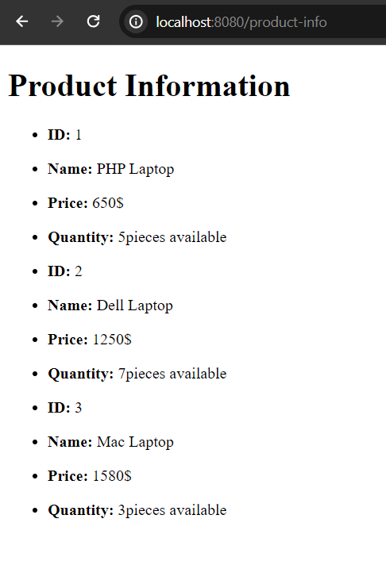

## Using Thymelaf th:each attribute:

In this tutorial, we are going to explore how to use thymelaf th:each attribute. <br/>

In thymelaf, th:each attribute is used to iterate obejcts or show iterable values unlike selecetion expression.

**Thymelaf th:each attribute syntax**

```
<ul th:each="name-of-alies : ${object_name}"></>
<li th:text="${alies.property_name}"></li>
<li th:text="${alies.property_name}"></li>
---
</ul>

//Such as: you have a product object with many products and it has product_id, name, price etc. as properties.

<ul th:each="product: ${products}"></>
<li th:text="${product.id}"></li>
<li th:text="${product.name}"></li>
<li th:text="${product.price}"></li>
---
</ul>
```
<br/><br/>

**Let's see a simple example of using th:each attribute**

1. Create a simple Spring Boot application from spring initializer [https://start.spring.io](https://start.spring.io) or please refer this tutorial: [Create Your First Spring Boot Application](https://javaondemand.com/create-your-first-spring-boot-application)

Note: Make sure you have added spring-boot-starter-web and spring-boot-starter-thymeleaf dependency in your claspath. (if maven then pom.xml file will be used to manage all the spring boot dependencies)

2. After creating your spring boot application please unzip it and then open it in your favourite web browser. Here, I use intellij ide. 

3. After opening your Spring Boot Demo application, create Product.java entity class file in com.company.entity package. 

**Product.java** class file:

```
package com.company.entity;
public class Product {
    private int id;
    private String name;
    private int price;
    private int quantity;

    public Product() {
    }

    public Product(int id, String name, int price, int quantity) {
        this.id = id;
        this.name = name;
        this.price = price;
        this.quantity = quantity;
    }

//getter and setter methods will go here
```

4. Now Create a controller class in **com.company.controller** package, for simplicity we name it **ProductCntroller.java** and also annotate the class by **@Controller** annotation.

**ProductController.java** file:

```
package com.company.controller;

import com.company.entity.Product;
import org.springframework.stereotype.Controller;
import org.springframework.ui.Model;
import org.springframework.web.bind.annotation.GetMapping;

import java.util.List;
@Controller
public class ProductController {
    @GetMapping("/product-info")
    public String showProduct(Model model){
        //create list of product
        List<Product> productList = List.of(new Product(1, "PHP Laptop", 650, 5),
                new Product(2, "Dell Laptop", 1250, 7),
                new Product(3, "Mac Laptop", 1580, 3)
                );
        model.addAttribute("products", productList); //here products will be used in product.html file
        return "product"; //product.html template file name
    }

}

```

5. In this step, we will create product.html file in **src/main/resources/templates** folder. All the thymeleaf template (html files) files will be located here.

**product.html** file: 

```
<!DOCTYPE html>
<html lang="en" xmlns:th="http://www.w3.org/1999/xhtml">
<html lang="en" xmlns:th="http://www.thymeleaf.org">
<head>
    <meta charset="UTF-8">
    <meta name="viewport" content="width=device-width, initial-scale=1.0">
    <title>Thymeleaf tutorial</title>
</head>
<body>
<div>
    <h1>Product Information</h1>
    <ul th:each="product : ${products}"> <!--Here the product is alies and ${products} is the attribute name comes from ProductController.java file-->

        <li>
            <p><b>ID:</b> <span th:text="${product.id}"></span></p>
        </li>
        <li>
            <p><b>Name:</b> <span th:text="${product.name}"></span></p>
        </li>
        <li>
            <p><b>Price:</b> <span th:text="${product.price}"></span>$</p>
        </li>
        <li>
            <p><b>Quantity:</b> <span th:text="${product.quantity}"></span>pieces available</p>
        </li>
    </ul>
</div>
</body>
</html>
```

6. Run the application and visit the url: http://localhost:8080/product-info 

The following page will be displayed:



It means, we have successfully retrieve the product data from the java component using th:each thymeleaf attribute tag.

Note: You can simply change the look and feel of your page using css.