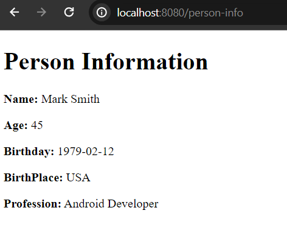

# Thyemeleaf Variable Expression

If you have spring boot application already in you system, add the thymeleaf dependency in your pom.xml file (if you use maven) or build.gradle file if you use gradle as a build tool. On the other hand, if you don't have any spring boot application yet, kindly create one from here: [https://start.spring.io](https://start.spring.io)


**Thymeleaf variable expression syntax**

```
${...}

//in template you will wirte
<p th:text="${name}"></p>
<p th:text="${product.name}"></p>
```

Note: The variable expression can be suite anywhere in your application. 

**Let's check out a simple example**

1. Open your spring boot project and create a simple controller class called **PersonController.java** class and annotate this class by **@Controller** annotation.

**PersonController.java** class:

```
package com.company.controller;

import org.springframework.stereotype.Controller;
import org.springframework.ui.Model;
import org.springframework.web.bind.annotation.GetMapping;

import java.time.LocalDate;

@Controller
public class PersonController {
    @GetMapping("/person-info")
    public String showPersonInfo(Model model){
        //create few test variables
        String name = "Mark Smith";
        int age = 45;
        LocalDate birthday = LocalDate.of(1979, 2, 12);
        String birthPlace = "USA";
        String profession = "Android Developer";

        //create attributes to access in the template (Attribute name can be anything)
        model.addAttribute("name", name);
        model.addAttribute("age", age);
        model.addAttribute("birthday", birthday);
        model.addAttribute("birthPlace", birthPlace);
        model.addAttribute("profession", profession);

        return "person-info"; //person-info.html file
    }
}

```

2. Now create **person-info.html** file in the templates folder.

**person-info.html** file will look like: 

```
<!DOCTYPE html>
<html lang="en" xmlns:th="http://www.w3.org/1999/xhtml">
<html lang="en" xmlns:th="http://www.thymeleaf.org">
<head>
    <meta charset="UTF-8">
    <meta name="viewport" content="width=device-width, initial-scale=1.0">
    <title>Thymeleaf tutorial</title>
</head>
<body>
<div>
    <h1>Person Information</h1>
    <div>
        <!-- using ${..} as a variable expression -->
        <p><b>Name:</b> <span th:text="${name}"></span></p>
        <p><b>Age:</b> <span th:text="${age}"></span></p>
        <p><b>Birthday:</b> <span th:text="${birthday}"></span></p>
        <p><b>BirthPlace:</b> <span th:text="${birthPlace}"></span></p>
        <p><b>Profession:</b> <span th:text="${profession}"></span></p>
    </div>
</div>
</body>
</html>
```

3. Now run the application and if you you invoke the url: [http://localhost:8080/person-info](http://localhost:8080/person-info) in your web browser then you will see the person dettails.




Note: The variable expression can be combined along with other expressions like url expression, message expression etc.
